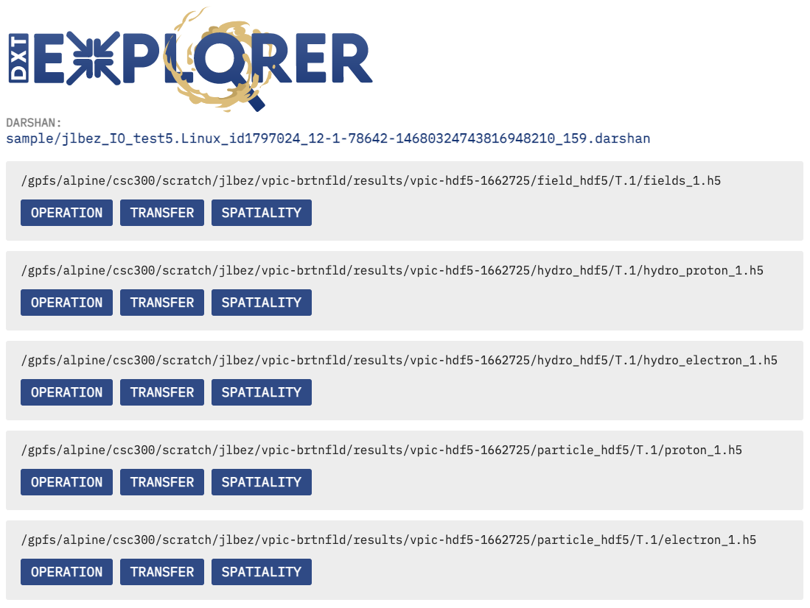

Exploring
===================================

Once you have the dependencies and DXT Explorer installed, you can run:

.. code-block:: bash

   dxt-explorer DARSHAN_FILE_COLLECTED_WITH_DXT_ENABLE.darshan

.. code-block:: text

  usage: dxt-explorer [-h] [-o OUTPUT] [-p PREFIX] [-t] [-s] [-i] [-oo] [-ot] [-r] [-u] [-st] [-d] [-l] [--start START] [--end END] [--from START_RANK] [--to END_RANK] [--browser] [-csv] [-v] darshan

  DXT Explorer:

  positional arguments:
    darshan               Input .darshan file

  optional arguments:
    -h, --help            show this help message and exit
    -o OUTPUT, --output OUTPUT
                          Output directory
    -p PREFIX, --prefix PREFIX
                          Output directory
    -t, --transfer        Generate an interactive data transfer explorer
    -s, --spatiality      Generate an interactive spatiality explorer
    -i, --io_phase        Generate an interactive I/O phase explorer
    -oo, --ost_usage_operation
                          Generate an interactive OST usage operation explorer
    -ot, --ost_usage_transfer
                          Generate an interactive OST usage data transfer size explorer
    -r, --rank_zero_workload
                          Determine if rank 0 is doing more I/O than the rest of the workload
    -u, --unbalanced_workload
                          Determine which ranks have unbalanced workload
    -st, --stragglers     Determine the 5 percent slowest operations in the time distribution
    -d, --debug           Enable debug mode
    -l, --list            List all the files with trace
    --start START         Report starts from X seconds (e.g., 3.7) from beginning of the job
    --end END             Report ends at X seconds (e.g., 3.9) from beginning of the job
    --from START_RANK     Report start from rank N
    --to END_RANK         Report up to rank M
    --browser             Open the browser with the generated plot
    -csv, --csv           Save the parsed DXT trace data into a csv
    -v, --version         show program's version number and exit

DXT Explorer will generate by default an ``index.html`` file with links to all interactive plots that you can open in any browser to explore. If you enabled the transfer or spatiality plots, additional ``.html`` files will be generated, one for each type and the link to those html files will be provided in the ``index.html`` file. 

You are expected to visualize the following messages in the console:

.. code-block:: text

   2022-11-02 12:58:22,979 dxt - INFO - FILE: <Filename> (ID <File ID>)
   2022-11-02 12:58:22,979 dxt - INFO - generating dataframes
   2022-11-02 12:58:26,681 dxt - INFO - generating interactive operation for: <Filename>
   2022-11-02 12:58:30,826 dxt - INFO - SUCCESS: <Path to the newly created Operation.html>
   2022-11-02 12:58:30,834 dxt - INFO - SUCCESS: <Path to the newly created Index.html>
   2022-11-02 12:58:30,834 dxt - INFO - You can open the index.html file in your browser to interactively explore all plots

You can find a couple of interactive examples of DXT traces collected from FLASH, E2E, and OpenPMD in the `companion repository <https://jeanbez.gitlab.io/pdsw-2021>`_ for our PDSW'21 paper.
