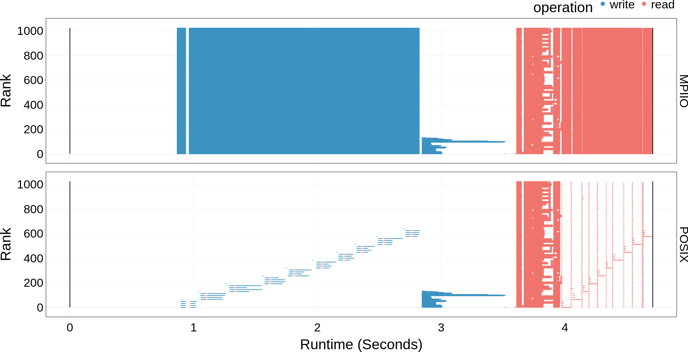

Operation Plot
===================================

Once the dependencies and DXT Explorer have been installed:

.. code-block:: bash

   dxt-explorer DARSHAN_FILE_COLLECTED_WITH_DXT_ENABLE.darshan

This will generate the base ``operation.html`` plot. The ``operation.html`` plot shows the read and write operations performed by each rank throughout the runtime of the application. Contextual information link ``Rank``, ``Operation``, ``Duration``, ``Size``, ``Offset``, ``Lustre OST`` can also be seen by hovering over a request. 

This is the expected console output when calling DXT Explorer:

.. code-block:: text

   2022-11-02 12:58:22,979 dxt - INFO - FILE: <Filename> (ID <File ID>)
   2022-11-02 12:58:22,979 dxt - INFO - generating dataframes
   2022-11-02 12:58:26,681 dxt - INFO - generating interactive operation for: <Filename>
   2022-11-02 12:58:30,826 dxt - INFO - SUCCESS: <Path to the newly created operation.html>
   2022-11-02 12:58:30,834 dxt - INFO - SUCCESS: <Path to the newly created index.html>
   2022-11-02 12:58:30,834 dxt - INFO - You can open the index.html file in your browser to interactively explore all plots

Interactive examples of DXT traces collected from FLASH, E2E, and OpenPMD are available in the `companion repository <https://jeanbez.gitlab.io/pdsw-2021>`_ of our PDSW'21 paper.
