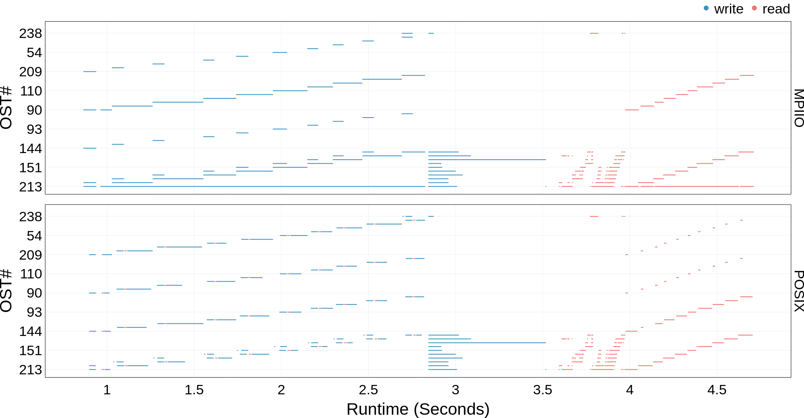

OST Usage Operation Plot
===================================

Once you have the dependencies and DXT Explorer installed, you can run:

.. code-block:: bash

   dxt-explorer -oo DARSHAN_FILE_COLLECTED_WITH_DXT_ENABLE.darshan

This will generate the ``ost-usage-operation.html`` plot. The ``ost-usage-operation.html`` plot shows the usage of each OST server for read and write operations throughout the runtime of the application.

``Warning``: This plot will only be generated if the application was exectued on Lustre File System and Darshan collected those metrics. 

You are expected to visualize the following messages in the console:

.. code-block:: text

   2022-11-02 12:58:22,979 dxt - INFO - FILE: <Filename> (ID <File ID>)
   2022-11-02 12:58:22,979 dxt - INFO - generating dataframes
   2022-11-02 12:58:26,681 dxt - INFO - generating interactive OST usage operation plot for: <Filename>
   2022-11-02 12:58:30,826 dxt - INFO - SUCCESS: <Path to the newly created operation.html>
   2022-11-02 12:58:30,834 dxt - INFO - SUCCESS: <Path to the newly created index.html>
   2022-11-02 12:58:30,834 dxt - INFO - You can open the index.html file in your browser to interactively explore all plots
