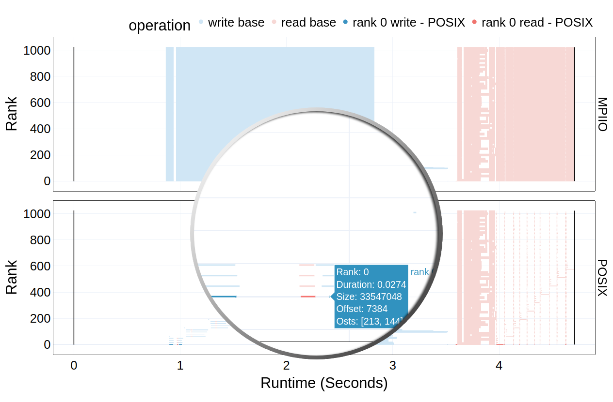

Rank Zero Heavy Workload Plot
===================================

Once you have the dependencies and DXT Explorer installed, you can run:

.. code-block:: bash

   dxt-explorer -r DARSHAN_FILE_COLLECTED_WITH_DXT_ENABLE.darshan

This will generate the base ``operation.html`` plot. On the right of the ``operation.html`` plot, a dropdown menu will be displayed which will have an option to display ``rank zero heavy workload`` bottleneck, if that bottleneck exists. Upon clicking that button, the rank zero workload will be highlighted on the graph with the other operations in the background in an opaque color. Contextual information link ``Rank``, ``Operation``, ``Duration``, ``Size``, ``Offset``, ``Lustre OST`` can also be seen by hovering over a request. 

You are expected to visualize the following messages in the console:

.. code-block:: text

   2022-11-02 12:58:22,979 dxt - INFO - FILE: <Filename> (ID <File ID>)
   2022-11-02 12:58:22,979 dxt - INFO - generating dataframes
   2022-11-02 12:58:26,681 dxt - INFO - generating interactive operation for: <Filename>
   2022-11-02 12:58:30,826 dxt - INFO - SUCCESS: <Path to the newly created operation.html>
   2022-11-02 12:58:30,834 dxt - INFO - SUCCESS: <Path to the newly created index.html>
   2022-11-02 12:58:30,834 dxt - INFO - You can open the index.html file in your browser to interactively explore all plots
   