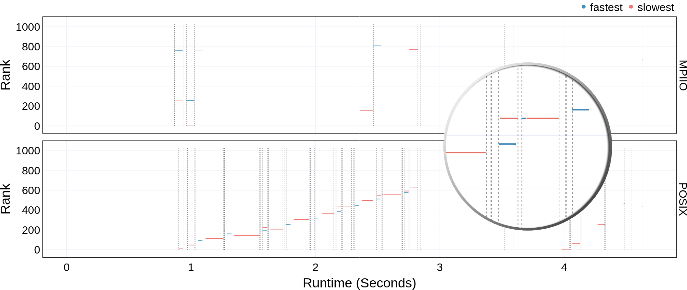

Stragglers Plot
===================================

Once you have the dependencies and DXT Explorer installed, you can run:

.. code-block:: bash

   dxt-explorer -st DARSHAN_FILE_COLLECTED_WITH_DXT_ENABLE.darshan

This will generate the base ``operation.html`` plot. On the right of the ``operation.html`` plot, a dropdown menu will be displayed which will have an option to display ``stragglers``, if that bottleneck exists. Upon clicking that button, the stragglers will be highlighted on the graph. Contextual information link ``Fastest Rank``, ``Fastest Rank Duration``, ``Slowest Rank``, ``Slowest Rank Duration`` can also be seen by hovering over a request. 

You are expected to visualize the following messages in the console:

.. code-block:: text

   2022-11-02 12:58:22,979 dxt - INFO - FILE: <Filename> (ID <File ID>)
   2022-11-02 12:58:22,979 dxt - INFO - generating dataframes
   2022-11-02 12:58:26,681 dxt - INFO - generating interactive spatiality for: <Filename>
   2022-11-02 12:58:30,826 dxt - INFO - SUCCESS: <Path to the newly created spatiality.html>
   2022-11-02 12:58:30,834 dxt - INFO - SUCCESS: <Path to the newly created index.html>
   2022-11-02 12:58:30,834 dxt - INFO - You can open the index.html file in your browser to interactively explore all plots
