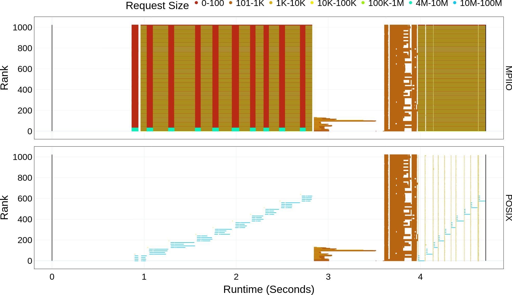

Transfer Plot
===================================

Once you have the dependencies and DXT Explorer installed, you can run:

.. code-block:: bash

   dxt-explorer -t DARSHAN_FILE_COLLECTED_WITH_DXT_ENABLE.darshan

This will generate the ``transfer.html`` plot. The ``transfer.html`` plot shows the amount of data transferred by read and write requests of each rank throughout the runtime of the application. The request sizes are coloured in the plot based on the bin sizes used in Darshan, but the absolute value, if available, can be seen by hovering over a request. Contextual information link ``Rank``, ``Operation``, ``Duration``, ``Size``, ``Offset``, ``Lustre OST`` can also be seen by hovering over a request. 

You are expected to visualize the following messages in the console:

.. code-block:: text

   2022-11-02 12:58:22,979 dxt - INFO - FILE: <Filename> (ID <File ID>)
   2022-11-02 12:58:22,979 dxt - INFO - generating dataframes
   2022-11-02 12:58:26,681 dxt - INFO - generating interactive transfer for: <Filename>
   2022-11-02 12:58:30,826 dxt - INFO - SUCCESS: <Path to the newly created transfer.html>
   2022-11-02 12:58:30,834 dxt - INFO - SUCCESS: <Path to the newly created index.html>
   2022-11-02 12:58:30,834 dxt - INFO - You can open the index.html file in your browser to interactively explore all plots

You can find a couple of interactive examples of DXT traces collected from FLASH, E2E, and OpenPMD in the `companion repository <https://jeanbez.gitlab.io/pdsw-2021>`_ for our PDSW'21 paper.
